# MMP (Multi-Messaging Paid Inbox)

[](https://github.com/gary322/Multi-Messaging-Paid/actions/workflows/ci.yml)

MMP is a production-style, end-to-end reference implementation of a **micropayment-enabled paid inbox**:

- Verified onboarding: **phone + email** via OTP
- Auth options: **wallet signature**, **WebAuthn passkeys**, **social OAuth (Google/GitHub)**
- Paid messaging: **simulated ledger** by default, with **on-chain USDC flows** supported (Hardhat localnet; configurable for Base)
- Opt-in notifications: **Telegram / WhatsApp / X**, gated by explicit consent + terms
- Production mechanics: **Postgres + Redis**, checkpointed **chain indexer**, retrying **delivery worker**
- Ops: launch readiness checks, abuse controls, and a local observability stack (Prometheus/Grafana/Tempo)

The canonical inbox is **in-app**. External channels are treated as **opt-in notification rails**.

## What MMP Is (and isn't)

**MMP is:**

- A blueprint you can run locally end-to-end (contracts + API + workers + observability)
- A reference architecture for "paid attention" messaging with compliance gates and ops tooling
- A monorepo you can deploy as a modular monolith (API + worker processes from the same `@mmp/api` package)

**MMP is not:**

- A way to send arbitrary iMessages or WhatsApp DMs as users (platform APIs do not support this reliably)
- A replacement for a security review: contracts are unaudited and should not be used on mainnet without audits
- A fully productized UX; the `web/` app is intentionally minimal

## Table Of Contents

- [Quickstart](#quickstart)
- [Architecture](#architecture)
- [Core Flows](#core-flows)
- [Data Model](#data-model)
- [Configuration](#configuration)
- [API Surface](#api-surface)
- [Workers](#workers)
- [Smart Contracts](#smart-contracts)
- [Observability](#observability)
- [Launch Gates and Compliance](#launch-gates-and-compliance)
- [Security Notes](#security-notes)
- [Testing](#testing)
- [Deployment Notes](#deployment-notes)
- [Troubleshooting](#troubleshooting)
- [Further Reading](#further-reading)

## Quickstart

### Prerequisites

- Node.js (CI uses Node 20)
- pnpm (repo pins `pnpm@10.28.2` via `package.json#packageManager`)
- Docker (required for `scripts/e2e-stack.sh` and the observability stack)

### Install

```bash
pnpm install
```

### Run Quality Gates

```bash
pnpm run ci
pnpm run hardening
```

### Run The Local E2E Runner (Contracts + API)

This uses a local Hardhat chain, deploys contracts, and runs the API chain-integration tests.

```bash
pnpm run e2e:local
```

### Run The Production-Like Local Stack (Postgres + Redis + Workers + Hardhat)

This starts Postgres and Redis via Docker Compose, runs migrations, starts a local Hardhat chain, deploys contracts,
enables indexer + delivery worker modes, and runs the full API suite.

```bash
bash scripts/e2e-stack.sh
```

### Run The Observability Smoke Test (Prometheus + Grafana + Tempo)

```bash
bash scripts/observability-smoke.sh
```

Grafana is exposed on `${MMP_GRAFANA_PORT:-3001}` (default credentials: `admin` / `mmp-grafana-admin`).

### Run API + Web (Manual Dev Mode)

In one terminal:

```bash
pnpm --dir api dev
```

In another terminal:

```bash
pnpm --dir web dev
```

Defaults:

- API: `http://localhost:4000`
- Web: `http://localhost:3000`

By default, the API uses SQLite at `data/mmp.sqlite`. For production-like runs, use Postgres + Redis (see
[Configuration](#configuration)).

## Architecture

### Monorepo Layout

- `api/`: Fastify API (TypeScript), workers, persistence, compliance, observability
- `contracts/`: Solidity contracts (Hardhat) for prepaid balances and message receipts
- `web/`: Next.js UI (minimal MVP) for onboarding, pricing, top-ups, send, inbox
- `infra/`: Docker Compose for local Postgres/Redis and observability stack
- `scripts/`: end-to-end runners and smoke checks
- `specs/`: product requirements/design/tasks
- `sop.txt`: original end-to-end blueprint/spec discussion

### System Overview (Context)

```mermaid
flowchart LR
  subgraph Clients
    WEB[Web UI (Next.js)]
    SCRIPTS[scripts / curl]
  end

  WEB -->|HTTP| API[API (Fastify)]
  SCRIPTS -->|HTTP| API

  API -->|SQL| DB[(Postgres / SQLite)]
  API -->|challenge state + distributed locks| R[(Redis)]

  API -->|RPC| CHAIN[(EVM Chain\nHardhat / Base)]

  %% Workers are separate processes from the same @mmp/api codebase.
  subgraph Workers
    IDX[Indexer Worker]
    DLW[Delivery Worker]
  end

  IDX -->|poll logs| CHAIN
  IDX -->|checkpoint + upsert| DB

  DLW -->|claim jobs + retry| DB
  DLW -->|notify| PROVIDERS[Telegram / WhatsApp / X]

  API -->|send OTP| OTP[Twilio / SendGrid\n(or console in dev)]
  API -->|OAuth| OAUTH[Google / GitHub]

  API -->|/v1/metrics| PROM[Prometheus]
  API -->|OTLP traces| TEMPO[Tempo]
  PROM --> GRAF[Grafana]
  TEMPO --> GRAF
  PROM --> AM[Alertmanager]
  AM -->|webhook| API
```

### Local Production-Like Stack

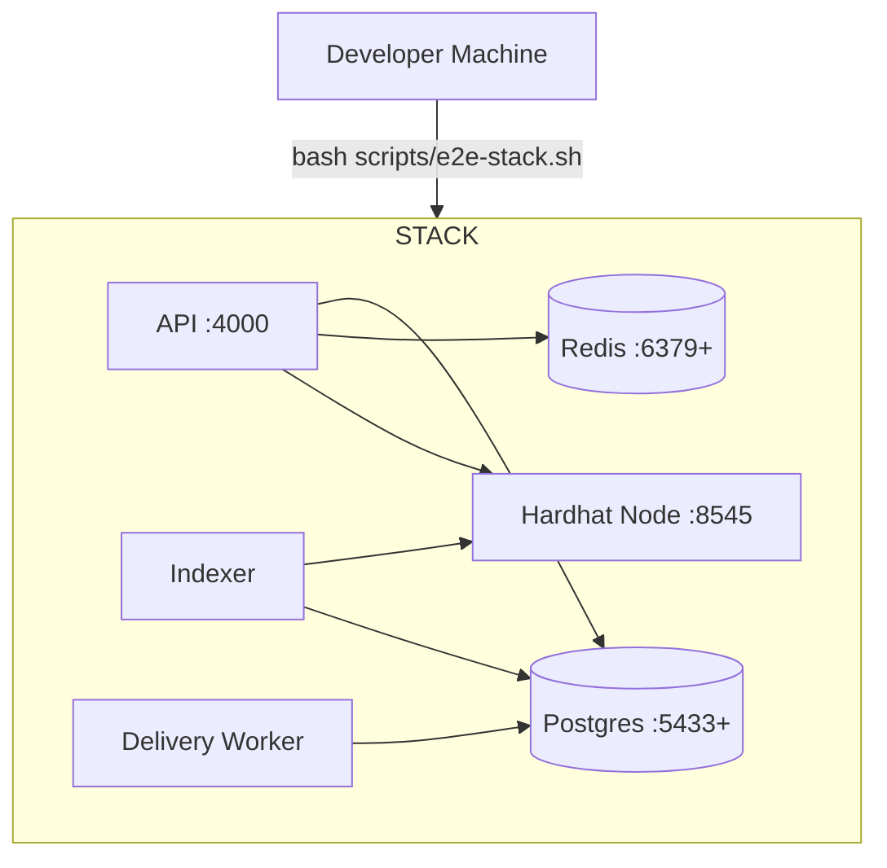

### Production Topology (Recommended)

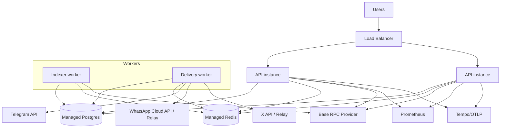

### CI Pipeline (GitHub Actions)

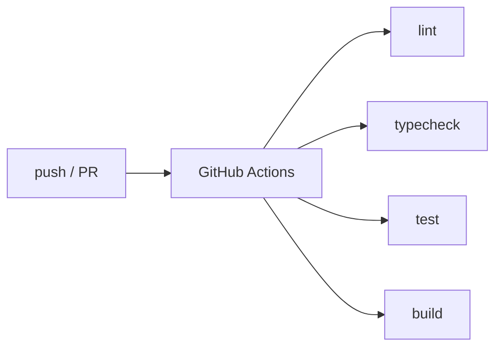

## Core Flows

### Paid Message Lifecycle (In-App + Optional On-Chain Receipt)

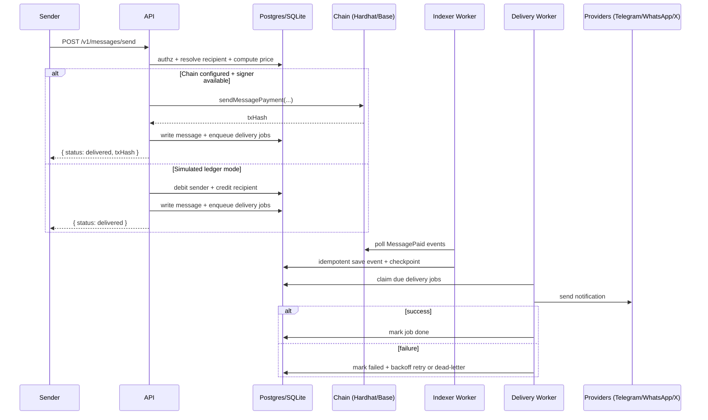

Notes:

- In-app delivery is always the source of truth; notifications must never block message access.
- Messages include a `content_hash` (for receipt/fingerprint), but the stored `ciphertext` is intentionally a placeholder
  in this reference implementation.

### OTP Verification (Phone + Email)

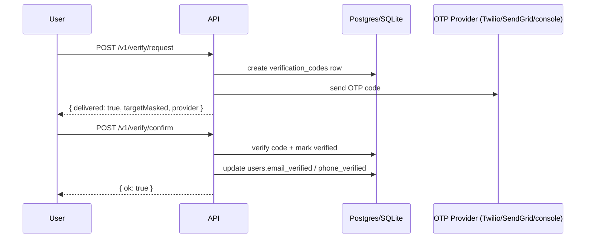

### Top Up + Withdraw

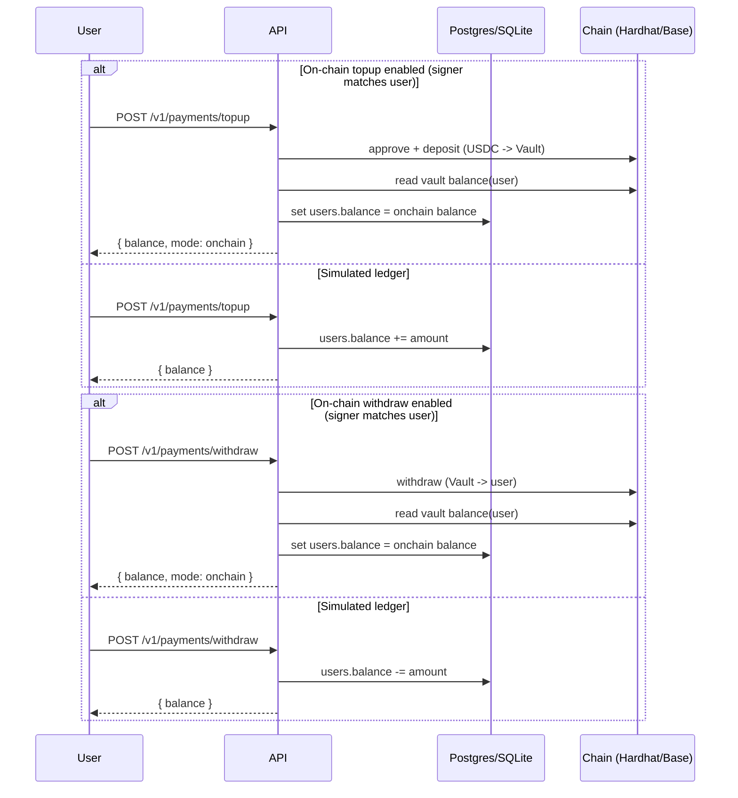

### Channel Connect + Consent Gates

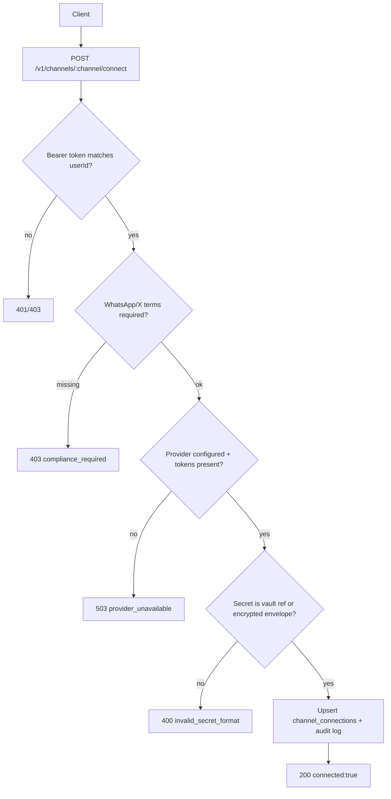

### Auth Modes (Wallet, Passkeys, Social)

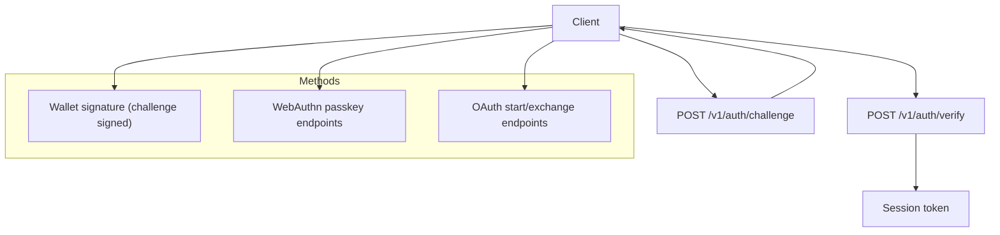

Notes:

- Wallet auth uses `ethers.verifyMessage` over the issued challenge.
- Passkey auth uses `@simplewebauthn/server` and creates a custodial EOA for the user (encrypted at rest).
- Social OAuth uses PKCE and creates a custodial EOA for the user (encrypted at rest).

## Data Model

This diagram matches the schema created by `api/src/lib/db.ts` for SQLite and Postgres.

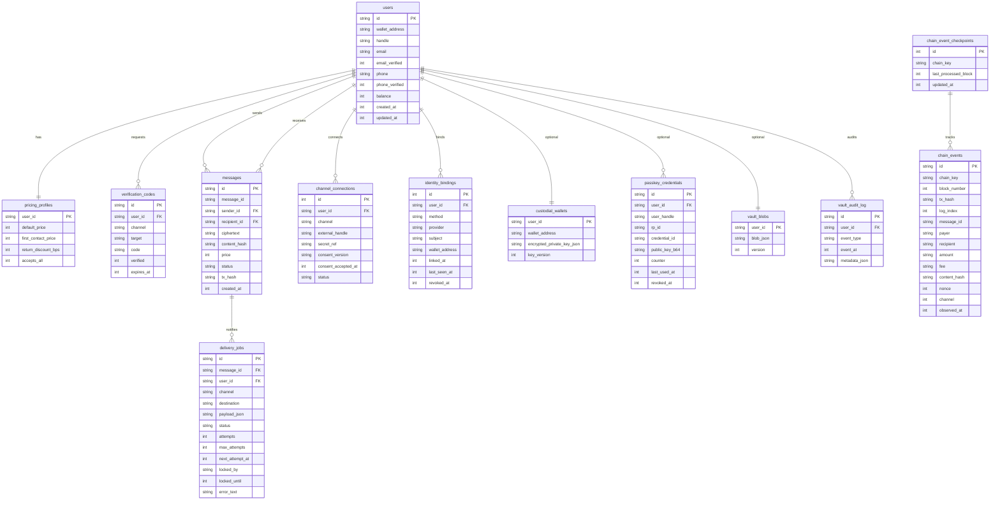

## Configuration

All configuration is read from environment variables. Defaults live in `api/src/config/env.ts`.

### Production-Like Persistence (Postgres + Redis)

For multi-instance durability and safe distributed workers, set:

1. `DATABASE_BACKEND=postgres`
2. `DATABASE_URL=postgresql://...`
3. `WORKER_DISTRIBUTED=true`
4. `REDIS_URL=redis://...`
5. `PERSISTENCE_STRICT_MODE=true` (defaults to true when `NODE_ENV=production`)

Migrations:

```bash
pnpm --dir api run migrate:postgres
```

### On-Chain Mode (Hardhat/Base)

To enable on-chain payments and the indexer:

1. Set `CHAIN_RPC_URL`
2. Set `CHAIN_VAULT_ADDRESS`
3. Set `CHAIN_USDC_ADDRESS` (local tests use `MockERC20` as USDC)
4. Set `CHAIN_INDEXER_ENABLED=true`
5. Set `DELIVERY_WORKER_ENABLED=true`

Signer selection for chain sends (in order):

1. User-provided `senderPrivateKey` or `privateKey` (blocked by default in production unless `ALLOW_UNSAFE_PRIVATE_KEY_INPUT=true`)
2. Custodial wallet stored for the user (created by passkey/social flows)
3. Global `CHAIN_PAYER_PRIVATE_KEY`

### Auth (Wallet / Passkeys / Social OAuth)

Passkeys (WebAuthn, local):

- `PASSKEY_RP_ID` (default `localhost`)
- `PASSKEY_ORIGIN` (default `http://localhost:3000`)

Social OAuth (local):

- Google: `OAUTH_GOOGLE_CLIENT_ID`, `OAUTH_GOOGLE_CLIENT_SECRET`, `OAUTH_GOOGLE_REDIRECT_URI`
- GitHub: `OAUTH_GITHUB_CLIENT_ID`, `OAUTH_GITHUB_CLIENT_SECRET`, `OAUTH_GITHUB_REDIRECT_URI`

Remote verifier mode (optional, strict identity):

- `IDENTITY_VERIFICATION_STRICT=true`
- `PASSKEY_VERIFY_URL` and/or `SOCIAL_VERIFY_URL`

Terms gating (recommended for WhatsApp/X and social/passkey auth):

- `REQUIRE_SOCIAL_TOS_ACCEPTED=true`
- `LEGAL_TOS_VERSION=v1` (or your current version)
- `LEGAL_TOS_APPROVED_AT=<timestamp>`

### Notification Providers (Telegram, WhatsApp, X)

Providers are optional, but can be enforced via launch gates.

- Telegram: `TELEGRAM_BOT_TOKEN`
- WhatsApp: configure either Cloud API (`WHATSAPP_PHONE_NUMBER_ID`, `WHATSAPP_ACCOUNT_TOKEN`) or a webhook relay (`WHATSAPP_WEBHOOK_URL`, `WHATSAPP_WEBHOOK_TOKEN`)
- X: configure either bearer token (`X_BEARER_TOKEN`) or webhook relay (`X_WEBHOOK_URL`, `X_WEBHOOK_TOKEN`)

Strict mode:

- `NOTIFICATION_PROVIDERS_STRICT=true` blocks connector usage unless required auth tokens are present.

### OTP Providers (Phone and Email)

- SMS: `OTP_SMS_PROVIDER=twilio` with `TWILIO_ACCOUNT_SID`, `TWILIO_AUTH_TOKEN`, `TWILIO_FROM_NUMBER`
- Email: `OTP_EMAIL_PROVIDER=sendgrid` with `SENDGRID_API_KEY`, `SENDGRID_FROM_EMAIL`

In non-production environments, `console` providers are supported for local testing.

### Observability

Metrics:

- `METRICS_ENABLED=true`
- `METRICS_ROUTE_TOKEN=...` (required in production)

The metrics route supports either:

- `x-metrics-token: <token>`
- `Authorization: Bearer <token>`

Tracing export (Tempo/OTLP):

- `OTEL_TRACING_ENABLED=true`
- `OTEL_TRACES_EXPORT_URL=http://127.0.0.1:4318/v1/traces`

## API Surface

This is the primary API shape used by the web MVP and the test suites.

Auth and sessions:

- `GET /v1/auth/providers`
- `POST /v1/auth/register`
- `POST /v1/auth/challenge`
- `POST /v1/auth/verify`
- `POST /v1/auth/issue-session`
- `GET /v1/auth/whoami`

Passkeys:

- `POST /v1/auth/passkey/register/options`
- `POST /v1/auth/passkey/register/verify`
- `POST /v1/auth/passkey/login/options`
- `POST /v1/auth/passkey/login/verify`

Social OAuth:

- `GET /v1/auth/social/providers`
- `POST /v1/auth/social/:provider/start`
- `POST /v1/auth/social/:provider/exchange`

Verification:

- `POST /v1/verify/request`
- `POST /v1/verify/confirm`

Profile and discovery:

- `PUT /v1/profile`
- `GET /v1/identity/:handle`
- `PUT /v1/pricing`
- `GET /v1/recipient/:selector`

Payments:

- `POST /v1/payments/topup`
- `POST /v1/payments/withdraw`

Messaging:

- `POST /v1/messages/send`
- `GET /v1/messages/inbox/:recipientId`

Channels:

- `POST /v1/channels/:channel/connect`
- `GET /v1/channels/:channel/status`
- `POST /v1/channels/:channel/disconnect`

Operations, compliance, observability:

- `GET /health`
- `GET /v1/compliance/status`
- `GET /v1/compliance/launch-readiness`
- `GET /v1/compliance/alerts`
- `GET /v1/observability/snapshot`
- `GET /v1/observability/alerts`
- `POST /v1/observability/alert-hook`
- `GET /v1/metrics`

### Minimal cURL Smoke (Simulated Ledger Mode)

Run the API (`pnpm --dir api dev`), then in another terminal:

```bash
# Requires: curl + node. Optional: jq for pretty output.
#
# 1) Register two users
SENDER=$(curl -s http://localhost:4000/v1/auth/register \
  -H 'content-type: application/json' \
  -d '{"walletAddress":"0x3C44CdDdB6a900fa2b585dd299e03d12FA4293BC","handle":"sender"}')

RECIP=$(curl -s http://localhost:4000/v1/auth/register \
  -H 'content-type: application/json' \
  -d '{"walletAddress":"0x90F79bf6EB2c4f870365E785982E1f101E93b906","handle":"alice"}')

SENDER_TOKEN=$(SENDER="$SENDER" node -p 'JSON.parse(process.env.SENDER).token')
RECIP_TOKEN=$(RECIP="$RECIP" node -p 'JSON.parse(process.env.RECIP).token')
SENDER_ID=$(SENDER="$SENDER" node -p 'JSON.parse(process.env.SENDER).user.id')
RECIP_ID=$(RECIP="$RECIP" node -p 'JSON.parse(process.env.RECIP).user.id')

# 2) Top up sender
curl -s http://localhost:4000/v1/payments/topup \
  -H "authorization: Bearer $SENDER_TOKEN" \
  -H 'content-type: application/json' \
  -d "{\"userId\":\"$SENDER_ID\",\"amount\":1000}"

# 3) Set recipient pricing
curl -s http://localhost:4000/v1/pricing \
  -H "authorization: Bearer $RECIP_TOKEN" \
  -H 'content-type: application/json' \
  -d "{\"userId\":\"$RECIP_ID\",\"defaultPrice\":200,\"firstContactPrice\":500,\"returnDiscountBps\":500,\"acceptsAll\":true}"

# 4) Send a paid message (recipientSelector can be @handle or phone if discoverable)
curl -s http://localhost:4000/v1/messages/send \
  -H "authorization: Bearer $SENDER_TOKEN" \
  -H 'content-type: application/json' \
  -d "{\"senderId\":\"$SENDER_ID\",\"recipientSelector\":\"@alice\",\"plaintext\":\"hello\"}"

# 5) Read inbox
curl -s "http://localhost:4000/v1/messages/inbox/$RECIP_ID" \
  -H "authorization: Bearer $RECIP_TOKEN"
```

## Workers

### Persistence Model

MMP supports three backends, primarily for local dev and tests:

- Postgres (recommended for production): durable storage + concurrency safety
- SQLite (local dev only): single-instance convenience
- JSON fallback (local-only): used if SQLite cannot be initialized

In strict persistence mode (`PERSISTENCE_STRICT_MODE=true`), the system enforces:

1. `DATABASE_BACKEND=postgres` and `DATABASE_URL` is set
2. Redis is configured for distributed worker safety when `WORKER_DISTRIBUTED=true`

### Worker Model

The codebase includes two production-style loops:

- Indexer worker: polls `MessagePaid` events and checkpoint-saves progress
- Delivery worker: claims `delivery_jobs`, sends notifications with retry/backoff, and dead-letters after max attempts

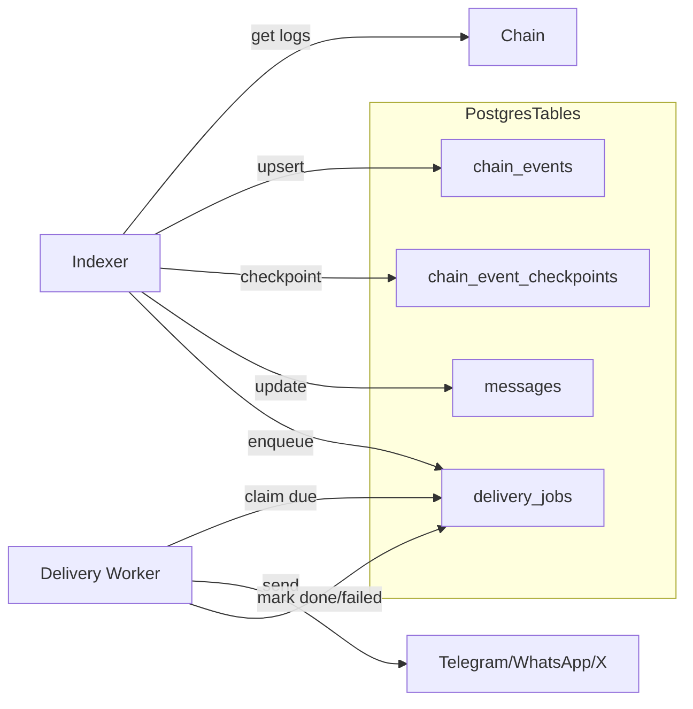

### Delivery Job State Machine

Dead-lettering is represented by `status='failed'` with an `error_text` prefixed by `max_retries_reached:`.

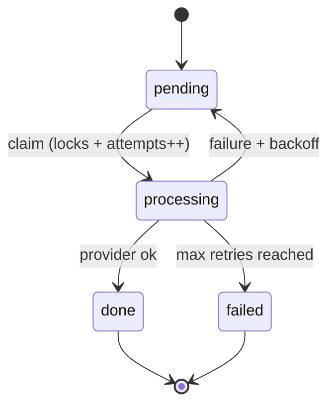

## Smart Contracts

The on-chain model uses a prepaid vault contract that emits receipts for each paid message.

Contracts:

- `contracts/contracts/PayInboxVault.sol`: ERC20 escrow, internal ledger, `MessagePaid` receipts, fee config, pause
- `contracts/contracts/PricingRegistry.sol`: per-user pricing policy and optional allowlists (no PII on-chain)

### PayInboxVault (Ledger + Receipts)

Key properties:

- Deposit and withdraw move ERC20 tokens
- Per-message payments are internal balance transfers and an emitted `MessagePaid` event

```mermaid
flowchart TB
  U[User Wallet] -->|approve + deposit| V[PayInboxVault]
  V -->|withdraw| U

  subgraph InternalLedger
    B1[balances[payer]]
    B2[balances[recipient]]
    BF[balances[feeRecipient]]
  end

  V --> B1
  V --> B2
  V --> BF

  V -->|emit| E[MessagePaid(payer, recipient, messageId, amount, fee, contentHash, nonce, channel)]
```

## Observability

Local stack components:

- Prometheus scrapes `GET /v1/metrics`
- Tempo receives OTLP traces (`OTEL_TRACES_EXPORT_URL`)
- Grafana dashboards are pre-provisioned
- Alertmanager routes alerts to `POST /v1/observability/alert-hook`

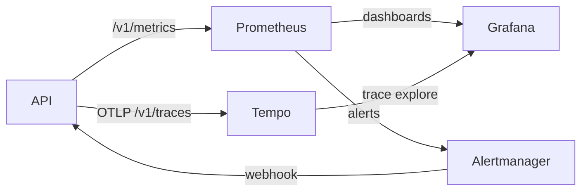

Helpful endpoints:

- `GET /v1/observability/snapshot`: worker and system snapshot
- `GET /v1/observability/alerts`: threshold-based health evaluation
- `GET /v1/compliance/launch-readiness`: launch gate report

See `docs/observability/README.md`.

## Launch Gates and Compliance

Launch readiness can be enforced at runtime and checked via the API.

Operational checks:

1. `GET /v1/compliance/status`
2. `GET /v1/compliance/launch-readiness`
3. `GET /v1/compliance/alerts`

Recommended production toggles:

1. `COMPLIANCE_ENFORCE_LAUNCH=true`
2. Decide whether to block on warnings via `COMPLIANCE_BLOCK_ON_WARN`
3. Keep `LAUNCH_STARTUP_GATING=true` to fail-fast on boot if critical dependencies are missing

See `docs/compliance/launch-gates.md` for the full gate definition.

## Security Notes

Key guardrails in this repo:

- Strict persistence mode blocks unsafe deployments (SQLite + multi-instance workers without Redis).
- Channel connect rejects plaintext secrets. Provide a vault reference (e.g. `vault:<ref>`) or an encrypted envelope JSON.
- Vault encryption uses AES-256-GCM with a server-side master key (`VAULT_MASTER_KEY`). For a true client-held
  "credential suitcase", add client-side encryption and key management.
- Private-key input is blocked by default in production (`ALLOW_UNSAFE_PRIVATE_KEY_INPUT=false`).
- Abuse controls are enabled by default and enforced in the message-send path.

Before mainnet usage, run the contract audit checklist:

- `docs/security/audit-checklist.md`

## Testing

Unit and integration:

```bash
pnpm -r test
```

API-only:

```bash
pnpm --dir api test
```

Contracts-only:

```bash
pnpm --dir contracts test
```

## Deployment Notes

This repo is designed to be run as a single codebase with production-style toggles.

Recommended production setup:

1. Run Postgres (managed) and Redis (managed).
2. Run at least two API instances behind a load balancer.
3. Run dedicated worker processes (same `@mmp/api` code) with `CHAIN_INDEXER_ENABLED=true` and `DELIVERY_WORKER_ENABLED=true`.
4. Enable launch enforcement and metrics auth tokens.
5. Configure at least one notification provider and OTP provider for real user verification.

## Troubleshooting

- Port conflicts: `scripts/e2e-stack.sh` auto-selects open ports for Postgres/Redis if defaults are taken.
- Docker networking: Prometheus scrapes `host.docker.internal:4000` by default. On Linux, you may need to adjust
  `infra/observability/prometheus.yml`.
- Grafana port: use `MMP_GRAFANA_PORT=...` if `3001` is taken.
- Production boot fails: check `GET /v1/compliance/launch-readiness` and verify required env vars are set.

## Further Reading

- `sop.txt`
- `specs/mmp/requirements.md`
- `specs/mmp/design.md`
- `specs/mmp/tasks.md`
- `docs/runbooks/operations.md`
- `docs/observability/README.md`
- `docs/compliance/launch-gates.md`
- `docs/security/audit-checklist.md`
