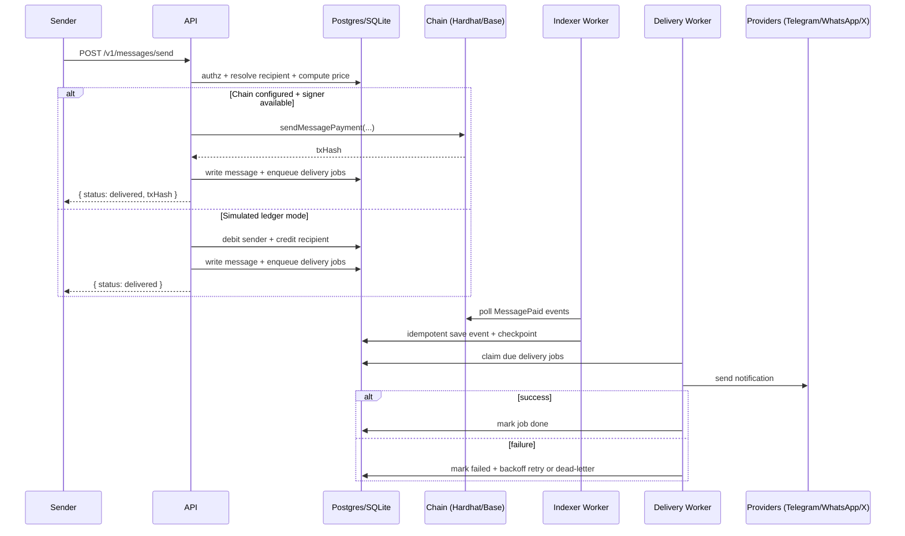
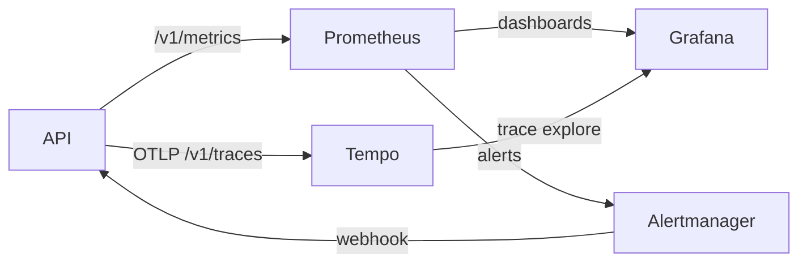

# MMP (Multi-Messaging Paid Inbox)

[](https://github.com/gary322/Multi-Messaging-Paid/actions/workflows/ci.yml)

MMP is a production-style, end-to-end reference implementation of a **micropayment-enabled paid inbox**:

- Users onboard and verify **phone + email** via OTP
- Users can connect optional notification channels (**Telegram / WhatsApp / X**) with explicit consent gates
- Messages are **paid** (simulated ledger by default, with **on-chain flows** supported via a local Hardhat chain)
- A production-style **indexer** + **delivery worker** pipeline processes on-chain events and retries notifications
- Built-in **launch readiness** and **compliance** checks, abuse controls, and a local observability stack

The canonical inbox is **in-app**. External channels are treated as **opt-in notification rails**.

## Table Of Contents

- Quickstart
- Architecture
- End-to-End Scripts
- Configuration
- API Surface
- Persistence, Indexer, Delivery Worker
- Smart Contracts
- Observability
- Launch Gates and Compliance
- Security Notes
- Testing
- Deployment Notes
- Troubleshooting
- Further Reading

## Quickstart

### Prerequisites

- Node.js (CI uses Node 20)
- pnpm (repo pins `pnpm@10.28.2` via `package.json#packageManager`)
- Docker (required for `scripts/e2e-stack.sh` and the observability stack)

### Install

```bash
pnpm install
```

### Run Quality Gates

```bash
pnpm run ci
pnpm run hardening
```

### Run The Local E2E Runner (Contracts + API)

This uses a local Hardhat chain, deploys contracts, and runs the API chain-integration tests.

```bash
pnpm run e2e:local
```

### Run The Production-Like Local Stack (Postgres + Redis + Workers + Hardhat)

This starts Postgres and Redis via Docker Compose, runs migrations, starts a local Hardhat chain, deploys contracts, enables indexer + delivery worker modes, and runs the full API suite.

```bash
bash scripts/e2e-stack.sh
```

### Run The Observability Smoke Test (Prometheus + Grafana + Tempo)

```bash
bash scripts/observability-smoke.sh
```

Grafana is exposed on `${MMP_GRAFANA_PORT:-3001}`.

## Architecture

### Monorepo Layout

- `api/`: Fastify API (TypeScript), workers, persistence, compliance, observability
- `contracts/`: Solidity contracts (Hardhat) for prepaid balances and message receipts
- `web/`: Next.js UI (minimal MVP) for onboarding, pricing, top-ups, send, inbox
- `infra/`: Docker Compose for local Postgres/Redis and observability stack
- `scripts/`: end-to-end runners and smoke checks
- `specs/`: product requirements/design/tasks
- `sop.txt`: original end-to-end blueprint/spec discussion

### System Overview

```mermaid
flowchart LR
  Web[Web UI (Next.js)] -->|HTTP| API[API (Fastify)]

  API -->|SQL| PG[(Postgres)]
  API -->|locks / ephemeral state| R[(Redis)]

  API -->|RPC| CHAIN[(EVM Chain: Hardhat / Base)]

  subgraph Workers
    IDX[Indexer Worker]
    DLW[Delivery Worker]
  end

  API --- IDX
  API --- DLW
  IDX -->|poll events| CHAIN
  IDX -->|checkpoint + upsert| PG
  DLW -->|claim jobs| PG
  DLW -->|send + retry| PROVIDERS[Telegram / WhatsApp / X]

  API -->|/v1/metrics| PROM[Prometheus]
  API -->|OTLP traces| TEMPO[Tempo]
  PROM --> GRAF[Grafana]
  TEMPO --> GRAF
  PROM --> AM[Alertmanager]
  AM -->|webhook| API
```

### Paid Message Lifecycle (In-App + Optional On-Chain Receipt)



### Auth Modes (Wallet, Passkeys, Social OAuth)

```mermaid
flowchart TB
  Client[Client] --> AuthChallenge[POST /v1/auth/challenge]
  AuthChallenge --> Client

  Client --> AuthVerify[POST /v1/auth/verify]
  AuthVerify --> User[User Session Token]

  subgraph Methods
    WalletSig[Wallet signature proof]
    Passkeys[WebAuthn passkeys]
    Social[OAuth (Google/GitHub)]
  end

  Client --> WalletSig
  Client --> Passkeys
  Client --> Social

  WalletSig --> AuthVerify
  Passkeys --> AuthVerify
  Social --> AuthVerify
```

## End-to-End Scripts

| Script | What It Does | Requires |
| --- | --- | --- |
| `scripts/e2e-local.sh` | Starts Hardhat node, deploys contracts, runs contract smoke, runs API chain integration tests, runs repo tests. | Node + pnpm |
| `scripts/e2e-stack.sh` | Starts Postgres + Redis (Docker), starts Hardhat node, deploys contracts, enables indexer + delivery workers, runs API postgres/redis integration suite. | Docker + Node + pnpm |
| `scripts/observability-smoke.sh` | Starts Prometheus/Grafana/Alertmanager/Tempo and validates metrics + OTLP trace export from the API. | Docker + Node + pnpm |

## Configuration

All configuration is read from environment variables. Defaults live in `api/src/config/env.ts`.

### Production-Like Persistence (Postgres + Redis)

For multi-instance durability and safe distributed workers, set:

1. `DATABASE_BACKEND=postgres`
2. `DATABASE_URL=postgresql://...`
3. `WORKER_DISTRIBUTED=true`
4. `REDIS_URL=redis://...`
5. `PERSISTENCE_STRICT_MODE=true` (defaults to true when `NODE_ENV=production`)

Migrations:

```bash
pnpm --dir api run migrate:postgres
```

### On-Chain Mode (Hardhat/Base)

To enable on-chain payments and the indexer:

1. Set `CHAIN_RPC_URL`
2. Set `CHAIN_VAULT_ADDRESS`
3. Set `CHAIN_USDC_ADDRESS` (local tests use `MockERC20` as USDC)
4. Set `CHAIN_INDEXER_ENABLED=true`
5. Set `DELIVERY_WORKER_ENABLED=true`

Signer selection for chain sends (in order):

1. User-provided `senderPrivateKey` or `privateKey` (blocked by default in production unless `ALLOW_UNSAFE_PRIVATE_KEY_INPUT=true`)
2. Custodial wallet stored for the user (created by passkey/social flows)
3. Global `CHAIN_PAYER_PRIVATE_KEY`

### Notification Providers (Telegram, WhatsApp, X)

Providers are optional, but can be enforced via launch gates.

- Telegram: `TELEGRAM_BOT_TOKEN`
- WhatsApp: configure either Cloud API (`WHATSAPP_PHONE_NUMBER_ID`, `WHATSAPP_ACCOUNT_TOKEN`) or a webhook relay (`WHATSAPP_WEBHOOK_URL`, `WHATSAPP_WEBHOOK_TOKEN`)
- X: configure either bearer token (`X_BEARER_TOKEN`) or webhook relay (`X_WEBHOOK_URL`, `X_WEBHOOK_TOKEN`)

Channel connections store opt-in evidence (`consent_version`, `consent_accepted_at`) and can be gated via:

- `REQUIRE_SOCIAL_TOS_ACCEPTED=true`
- `LEGAL_TOS_VERSION=...`
- `LEGAL_TOS_APPROVED_AT=...`

### OTP Providers (Phone and Email)

- SMS: `OTP_SMS_PROVIDER=twilio` with `TWILIO_ACCOUNT_SID`, `TWILIO_AUTH_TOKEN`, `TWILIO_FROM_NUMBER`
- Email: `OTP_EMAIL_PROVIDER=sendgrid` with `SENDGRID_API_KEY`, `SENDGRID_FROM_EMAIL`

In non-production environments, `console` providers are supported for local testing.

### Observability

Metrics:

- `METRICS_ENABLED=true`
- `METRICS_ROUTE_TOKEN=...` (required in production)

The metrics route supports either:

- `x-metrics-token: <token>`
- `Authorization: Bearer <token>`

Tracing export (Tempo/OTLP):

- `OTEL_TRACING_ENABLED=true`
- `OTEL_TRACES_EXPORT_URL=http://127.0.0.1:4318/v1/traces`

## API Surface

This is the primary API shape used by the web MVP and the test suites.

Auth and sessions:

- `GET /v1/auth/providers`
- `POST /v1/auth/register`
- `POST /v1/auth/challenge`
- `POST /v1/auth/verify`
- `POST /v1/auth/issue-session`
- `GET /v1/auth/whoami`

Passkeys:

- `POST /v1/auth/passkey/register/options`
- `POST /v1/auth/passkey/register/verify`
- `POST /v1/auth/passkey/login/options`
- `POST /v1/auth/passkey/login/verify`

Social OAuth:

- `GET /v1/auth/social/providers`
- `POST /v1/auth/social/:provider/start`
- `POST /v1/auth/social/:provider/exchange`

Verification:

- `POST /v1/verify/request`
- `POST /v1/verify/confirm`

Profile and discovery:

- `PUT /v1/profile`
- `GET /v1/identity/:handle`
- `PUT /v1/pricing`
- `GET /v1/recipient/:selector`

Payments:

- `POST /v1/payments/topup`
- `POST /v1/payments/withdraw`

Messaging:

- `POST /v1/messages/send`
- `GET /v1/messages/inbox/:recipientId`

Channels:

- `POST /v1/channels/:channel/connect`
- `GET /v1/channels/:channel/status`
- `POST /v1/channels/:channel/disconnect`

Operations, compliance, observability:

- `GET /health`
- `GET /v1/compliance/status`
- `GET /v1/compliance/launch-readiness`
- `GET /v1/compliance/alerts`
- `GET /v1/observability/snapshot`
- `GET /v1/observability/alerts`
- `POST /v1/observability/alert-hook`
- `GET /v1/metrics`

## Persistence, Indexer, Delivery Worker

### Persistence Model

MMP supports three backends, primarily for local dev and tests:

- Postgres (recommended for production): durable storage + concurrency safety
- SQLite (local dev only): single-instance convenience
- JSON fallback (local-only): used if SQLite cannot be initialized

In strict persistence mode (`PERSISTENCE_STRICT_MODE=true`), the system enforces:

1. `DATABASE_BACKEND=postgres` and `DATABASE_URL` is set
2. Redis is configured for distributed worker safety when `WORKER_DISTRIBUTED=true`

### Worker Model

The codebase includes two production-style loops:

- Indexer worker: polls `MessagePaid` events and checkpoint-saves progress
- Delivery worker: claims `delivery_jobs`, sends notifications with retry/backoff, and dead-letters after max attempts


## Smart Contracts

The on-chain model uses a prepaid vault contract that emits receipts for each paid message.

Contracts:

- `contracts/contracts/PayInboxVault.sol`: ERC20 escrow, internal ledger, `MessagePaid` receipts, fee config, pause
- `contracts/contracts/PricingRegistry.sol`: per-user pricing policy and optional allowlists (no PII on-chain)

### PayInboxVault (Ledger + Receipts)

Key properties:

- Deposit and withdraw move ERC20 tokens
- Per-message payments are internal balance transfers and an emitted `MessagePaid` event

```mermaid
flowchart TB
  U[User Wallet] -->|approve + deposit| V[PayInboxVault]
  V -->|withdraw| U

  subgraph Internal Ledger
    B1[balances[payer]]
    B2[balances[recipient]]
    BF[balances[feeRecipient]]
  end

  V --> B1
  V --> B2
  V --> BF

  V -->|emit| E[MessagePaid(payer, recipient, messageId, amount, fee, contentHash, nonce, channel)]
```

### PricingRegistry (Policy)

Stores recipient pricing config and allowlist discounts. This contract is separate from the vault so pricing policy can evolve independently.

## Observability

Local stack components:

- Prometheus scrapes `GET /v1/metrics`
- Tempo receives OTLP traces (`OTEL_TRACES_EXPORT_URL`)
- Grafana dashboards are pre-provisioned
- Alertmanager routes alerts to `POST /v1/observability/alert-hook`



Helpful endpoints:

- `GET /v1/observability/snapshot`: worker and system snapshot
- `GET /v1/observability/alerts`: threshold-based health evaluation
- `GET /v1/compliance/launch-readiness`: launch gate report

## Launch Gates And Compliance

Launch readiness can be enforced at runtime and checked via the API.

Operational checks:

1. `GET /v1/compliance/status`
2. `GET /v1/compliance/launch-readiness`
3. `GET /v1/compliance/alerts`

Recommended production toggles:

1. `COMPLIANCE_ENFORCE_LAUNCH=true`
2. Decide whether to block on warnings via `COMPLIANCE_BLOCK_ON_WARN`
3. Keep `LAUNCH_STARTUP_GATING=true` to fail-fast on boot if critical dependencies are missing

See `docs/compliance/launch-gates.md` for the full gate definition.

## Security Notes

Key guardrails in this repo:

- Strict persistence mode blocks unsafe deployments (SQLite + multi-instance workers without Redis).
- Connector secrets are not accepted in plaintext. Channel connect requires an encrypted envelope or vault reference.
- Vault encryption uses AES-256-GCM (server-side master key). If you need a true client-held "credential suitcase", add client-side encryption and key management.
- Abuse controls are enabled by default and enforced in the message-send path.

Before mainnet usage, run the contract audit checklist:

- `docs/security/audit-checklist.md`

## Testing

Unit and integration:

```bash
pnpm -r test
```

API-only:

```bash
pnpm --dir api test
```

Contracts-only:

```bash
pnpm --dir contracts test
```

## Deployment Notes

This repo is designed to be run as a single codebase with production-style toggles.

Recommended production setup:

1. Run Postgres (managed) and Redis (managed).
2. Run at least two API instances behind a load balancer.
3. Run dedicated worker processes (same `@mmp/api` code) with `CHAIN_INDEXER_ENABLED=true` and `DELIVERY_WORKER_ENABLED=true`.
4. Enable launch enforcement and metrics auth tokens.
5. Configure at least one notification provider and OTP provider for real user verification.

## Troubleshooting

- Port conflicts: `scripts/e2e-stack.sh` auto-selects open ports for Postgres/Redis if defaults are taken.
- Docker networking: Prometheus scrapes `host.docker.internal:4000` by default. On Linux, you may need to adjust `infra/observability/prometheus.yml`.
- Grafana port: use `MMP_GRAFANA_PORT=...` if `3001` is taken.
- Production boot fails: check `GET /v1/compliance/launch-readiness` and verify required env vars are set.

## Further Reading

- `sop.txt`
- `specs/mmp/requirements.md`
- `specs/mmp/design.md`
- `specs/mmp/tasks.md`
- `docs/runbooks/operations.md`
- `docs/observability/README.md`
- `docs/compliance/launch-gates.md`
- `docs/security/audit-checklist.md`
